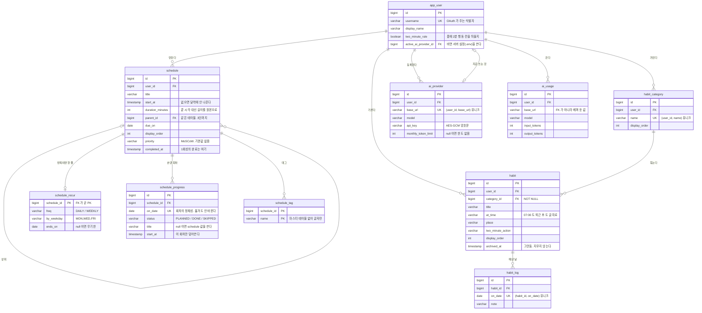

# 구조

> 화면과 기능은 [README](./README.md) 에 있습니다. 이 문서는 **코드가 어떻게 생겼는지**를 다룹니다.

## 데이터 모델

테이블 10개. 마이그레이션은 `backend/src/main/resources/db/migration/` 의 `V1`~`V3` 입니다.

```mermaid
erDiagram
    app_user ||--o{ schedule : "만든다"
    app_user ||--o{ habit_category : "가진다"
    app_user ||--o{ habit : "기른다"
    app_user ||--o{ ai_provider : "등록한다"
    app_user ||--o{ ai_usage : "쓴다"
    app_user |o--o| ai_provider : "지금 쓰는 것"

    schedule |o--o{ schedule : "상위"
    schedule ||--o| schedule_recur : "반복이면 한 줄"
    schedule ||--o{ schedule_progress : "손댄 회차"
    schedule ||--o{ schedule_tag : "태그"

    habit_category ||--o{ habit : "묶는다"
    habit ||--o{ habit_log : "해낸 날"

    app_user {
        bigint id PK
        varchar username UK "OAuth 가 주는 식별자"
        varchar display_name
        boolean two_minute_rule "폼에 2분 행동 칸을 띄울지"
        bigint active_ai_provider_id FK "비면 서버 설정(.env)을 쓴다"
    }

    schedule {
        bigint id PK
        bigint user_id FK
        varchar title
        timestamp start_at "없으면 달력에 안 나온다"
        int duration_minutes "끝 시각 대신 길이를 원본으로"
        bigint parent_id FK "같은 테이블. 3단까지"
        date due_on
        int display_order
        varchar priority "MoSCoW. 기본값 없음"
        timestamp completed_at "1회성의 완료는 여기"
    }

    schedule_recur {
        bigint schedule_id PK "FK 가 곧 PK"
        varchar freq "DAILY / WEEKLY"
        varchar by_weekday "MON,WED,FRI"
        date ends_on "null 이면 무기한"
    }

    schedule_progress {
        bigint id PK
        bigint schedule_id FK
        date on_date UK "회차의 정체성. 옮겨도 안 바뀐다"
        varchar status "PLANNED / DONE / SKIPPED"
        varchar title "null 이면 schedule 값을 쓴다"
        timestamp start_at "이 회차만 덮어쓴다"
    }

    schedule_tag {
        bigint schedule_id PK
        varchar name PK "마스터 테이블 없이 글자만"
    }

    habit_category {
        bigint id PK
        bigint user_id FK
        varchar name UK "(user_id, name) 유니크"
        int display_order
    }

    habit {
        bigint id PK
        bigint user_id FK
        bigint category_id FK "NOT NULL"
        varchar title
        varchar at_time "07:00 도 퇴근 후 도 글자로"
        varchar place
        varchar two_minute_action
        int display_order
        timestamp archived_at "그만둠. 지우지 않는다"
    }

    habit_log {
        bigint id PK
        bigint habit_id FK
        date on_date UK "(habit_id, on_date) 유니크"
        varchar note
    }

    ai_provider {
        bigint id PK
        bigint user_id FK
        varchar base_url UK "(user_id, base_url) 유니크"
        varchar model
        varchar api_key "AES-GCM 암호문"
        int monthly_token_limit "null 이면 한도 없음"
    }

    ai_usage {
        bigint id PK
        bigint user_id FK
        varchar base_url "FK 가 아니라 베껴 둔 값"
        varchar model
        int input_tokens
        int output_tokens
    }
```
