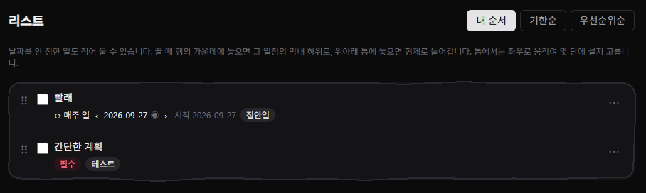
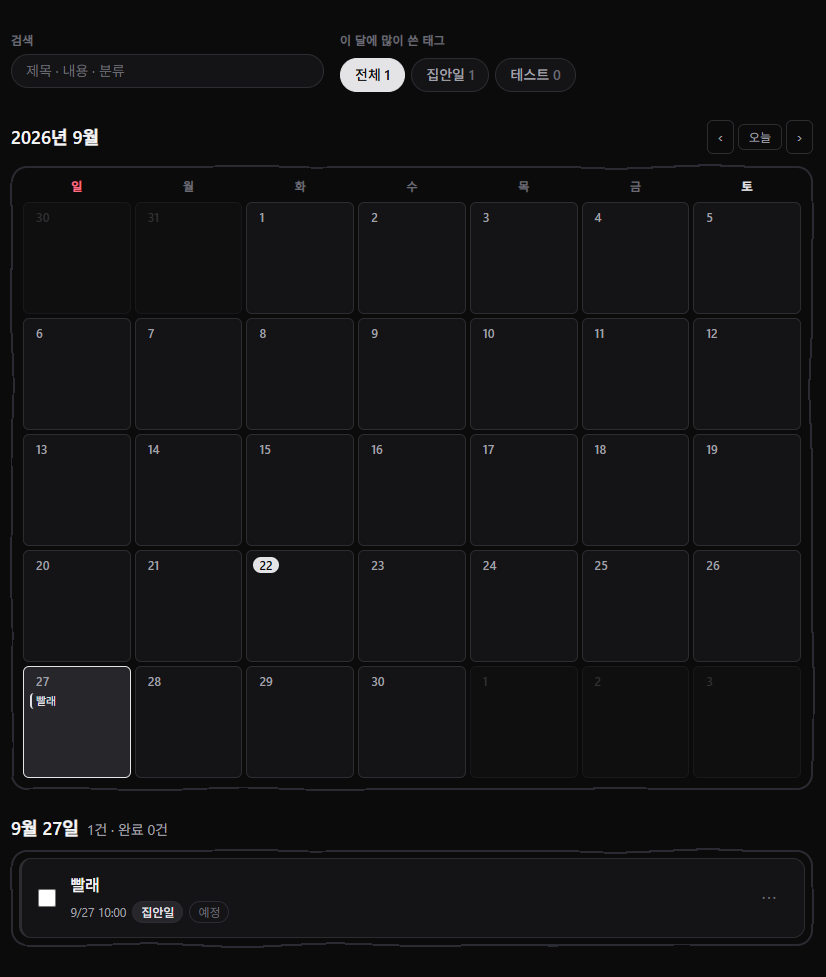
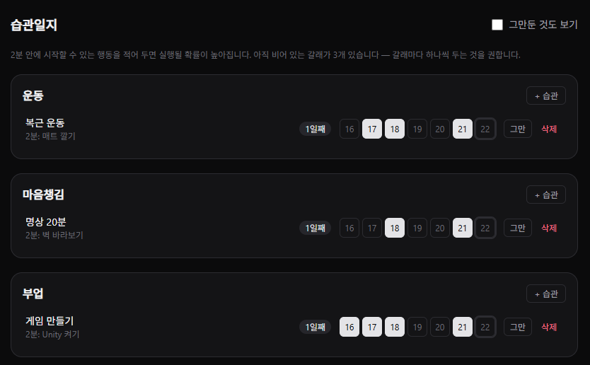
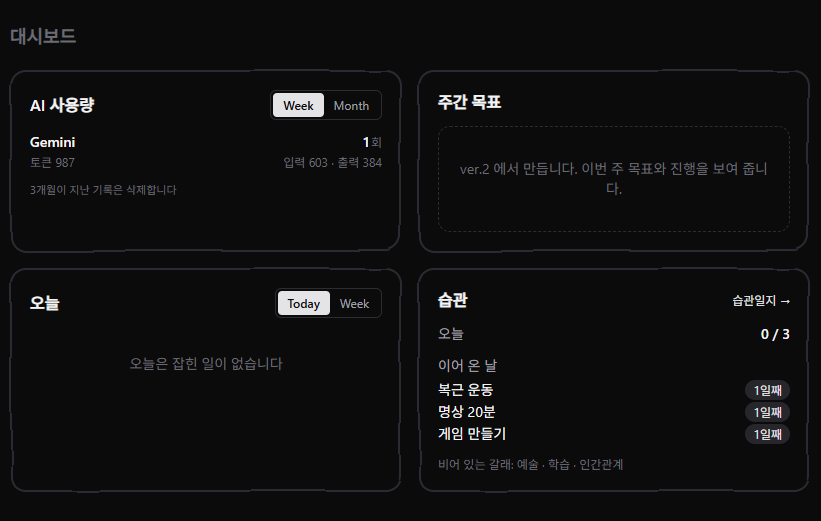
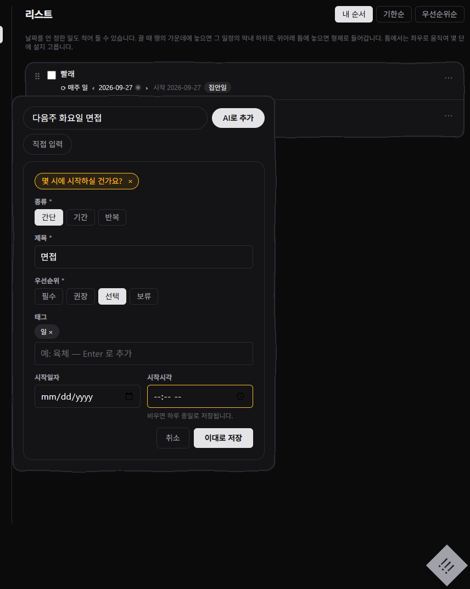

# LonelyTracker

> 자기개발 기록을 위한 일정 관리 웹앱입니다.
> Claude Code로 작업 중입니다. 개발자도 직접 코드 수정 중이지만 중대한 버그가 있을 수 있습니다.

---

## 화면 소개

탭 넷이 같은 일정을 서로 다른 눈으로 봅니다. 일정은 한 벌만 있고, 탭이 보기를 바꿉니다.

### 리스트

  
   
  간단한 메모도 일정처럼 적어 둘 수 있습니다

"언젠가 해야 하는데 언제인지 안 정해진 것"을 달력에다 적어놓을 순 없습니다 
LonelyTracker에서는 이런 경우를 위해 리스트에 모든 계획과 메모를 표시할 수 있게 구성했습니다 
물론 리스트에 적힌 계획 중 일정이 있는 것은 캘린더에도 표시됩니다

##### 적용된 기능

- **3단 계층** — 끌어서 하위로 넣거나 형제로 빼냅니다. 틈에서 좌우로 움직여 몇 단에 설지 고릅니다
- **MoSCoW 우선순위** — 필수 · 권장 · 선택 · 보류. 값을 정하지 않은 것과 "선택"으로 정한 것을 구분합니다
- **여러 종류의 정렬방식** — 내 순서 · 기한순 · 우선순위순. 보기만 바뀌고 저장한 순서는 그대로입니다
- **상위 일정 상태 따라감** — 부모를 끝내면 자손도 함께 끝납니다

### 달력

  
   
  월간 격자와 그 날의 목록을 확인할 수 있습니다

- **반복 일정** — 매일, 혹은 매주 요일마다 반복되는 일정을 구성할 수 있습니다
- **회차 옮김·건너뜀** — 한 회차만 다른 날로 옮기거나 건너뛸 수 있습니다. 옮긴 회차에는 `↻ 옮김`이 붙습니다
- **태그** — 태그와 키워드 검색으로 원하는 일정을 찾을 수 있습니다
- **리스트 연동** — 리스트의 데이터와 완전히 연동됩니다 (다만 우선순위 등은 표시되지 않습니다)

### 습관일지

  
   
  달력이 "수행할 일정"을 보여준다면, 습관 탭은 "행동 기록"을 보여줍니다

- **좋은 습관 형성** — 좋은 삶에 필요한 습관을 운동 · 마음챙김 · 부업 · 예술 · 학습 · 인간관계 여섯 가지 테마로 나눠 담았습니다
- **연속일 측정** — 며칠째 이어 왔는지 셉니다. 보람을 느낄 수 있게 더 풍성하게 보여주는 방법을 개발 중입니다
- **2분 법칙** — 2분 법칙(_Atomic Habits_)과 **실행 의도**(implementation intention)를 통해 습관을 어렵지 않게 달성할 수 있게 만듭니다
  | 칸 | 내용 |
  | --------- | -------------------------------------------------------------------------------- |
  | 목표 | 이루고 싶은 것 |
  | 행동 | 목표 달성을 위해 해야 할 구체적 행동 |
  | 시간/장소 | 언제, 어디서 (구체적일수록 좋습니다) |
  | 2분 행동 | 시작에 필요한 2분 이내 미니 행동 (`"헬스장 가기"` → `"퇴근 후 운동복 갈아입기"`) |

   
  다만 2분 법칙은 알면서도 잘 지켜지지 않습니다. 
  시간과 장소와 2분 행동을 꼼꼼히 적고 실행하는 일이 생각보다 귀찮고, 
  습관이 되기 전에 그만두게 되고, 이를 보완하기 위해 계획만 거창해지기도 합니다 
   

  > **그래서 그 코칭을 AI에게 맡기는 것이 가장 좋은 방법**이라고 생각했습니다 
  > 실행하는 것이 어쨌든 제일 중요하니까요

### 대시보드

  
   
  오늘의 필수 · 권장 · 마감, 습관, 주간 목표, AI 사용량을 모아서 보여줍니다

### 빠른 추가

  
   
  어느 탭에서든 우하단 버튼으로 엽니다

한 줄로 적거나, 칸을 채워 적습니다. 탭을 옮겨 다니지 않아도 됩니다.

---

## AI 가 하는 일

**"다음 주 화요일 저녁 7시에 헬스장, 끝나고 장보기"** 한 줄이 일정 두 개가 됩니다.

|                            |                                                                                          |
| -------------------------- | ---------------------------------------------------------------------------------------- |
| 여러 개를 뽑습니다         | 한 문장에 일정이 둘이면 둘 다 만듭니다                                                   |
| 모자라면 되묻습니다        | 시간이 없으면 "언제로 할까요"를 메세지로 띄웁니다                                        |
| **바로 저장하지 않습니다** | 초안으로 보여주고, 고친 다음 저장합니다. AI가 틀렸을 때 되돌릴 일이 없습니다             |
| 못 읽으면 취소합니다       | 일정으로 읽히지 않으면 오류가 아니라 직접 입력칸으로 넘어갑니다 (AI 사용량은 책정됩니다) |

**원하는 AI API를 직접 설정합니다.** OpenAI · Gemini · Claude 를 고르거나, OpenAI 호환 주소면 목록에 없는 곳도 씁니다 
키는 AES-GCM 으로 암호화해 저장하고 응답에 절대 싣지 않습니다 
제공자마다 **이번 달 토큰 한도**를 정해 둘 수 있습니다. 넘으면 AI를 부르지 않고 안내만 반환합니다 
쓴 양은 대시보드에서 확인할 수 있습니다

---

# 목표

> 목표는 개발 중간에 조금씩 바뀔 수 있습니다
> 참고 부탁드립니다

| 버전        | 한 줄                        | 무엇이 달라지나                                       | 상태          |
| ----------- | ---------------------------- | ----------------------------------------------------- | ------------- |
| **Ver.1**   | 계정 없이 clone 해서 쓰는 앱 | 일정·습관·AI 입력이 한 벌로 돕니다                    | 🔶 마무리 중  |
| **Ver.1.1** | 편의 기능                    | 프로젝트 · 테마 · 알림                                | ⬜ 예정       |
| **Ver.1.2** | 기능 전반을 AI 로 관리       | 입력뿐 아니라 관리까지 맡깁니다                       | ⭐ **최중요** |
| **Ver.1.3** | 외부 앱 연동                 | 이메일 · 구글 캘린더                                  | ⬜ 예정       |
| **Ver.1.4** | 로그인과 구독제              | 키도 DB 도 없이 쓰게 합니다. clone 은 계속 무료입니다 | ❔ 미정       |

🔶 진행 중 · ⭐ 가장 중요 · ⬜ 예정 · ❔ 할지 미정

## Ver.1 목표

> **계정 없이 clone 해서 쓰는 앱입니다.** 로그인도 서버도 필요 없습니다.
> 각자 자기 컴퓨터에서 띄우고, AI 기능을 쓰려면 자기 API 키만 넣습니다.

기능은 거의 완성되어가고 있습니다. 남은 것은 디자인, 로직 다듬기, 일부 기능과 버그의 수정 뿐입니다.

| 기능                            | 백엔드 | 프론트엔드 |
| ------------------------------- | ------ | ---------- |
| 일정 CRUD (기간·상태·분류 필터) | ✅     | ✅         |
| 소유자 기반 데이터 격리         | ✅     | —          |
| 태그 (후보 자동 완성)           | ✅     | ✅         |
| 우선순위 (MoSCoW)               | ✅     | ✅         |
| 일정 계층 (3단) · 드래그 재정렬 | ✅     | ✅         |
| 완료 연쇄 (부모 → 자손)         | ✅     | ✅         |
| 반복 일정 (매일·매주 요일)      | ✅     | ✅         |
| 회차 완료·건너뛰기              | ✅     | ✅         |
| 마감기한                        | ✅     | ✅         |
| 리스트 탭                       | ✅     | ✅         |
| 달력 탭 (월간)                  | ✅     | ✅         |
| 습관일지 탭 (6갈래 · 연속일)    | ✅     | ✅         |
| 자연어 입력 파싱 (AI · 다건)    | ✅     | ✅         |
| 사용자별 API 키 (암호화 저장)   | ✅     | ✅         |
| AI 제공자 선택 (OpenAI 호환)    | ✅     | ✅         |
| 제공자별 사용량·월 토큰 한도    | ✅     | ✅         |
| 대시보드 탭                     | ✅     | ✅         |
| 목표·장소·2분 행동 필드         | ✅     | ✅         |
| 디자인 결정 및 세부 조정        | —      | 🔶         |

✅ 완료 · 🔶 진행 중 · — 해당 없음

달력의 주간·연간 보기는 현재 ver.1 범위 밖입니다. 월간 격자 하나로 보여줍니다.

---

## Ver.1.1 목표

> **기본적으로 탑재할 기능(프로젝트 등)과 테마, 알림 기능 등 편의성 기능을 구현합니다**

| 항목                 | 내용                                                                         |
| -------------------- | ---------------------------------------------------------------------------- |
| 프로젝트 탭          | 일정 위에 얹는 상위 단위입니다. 메뉴에 자리는 잡아 뒀고 화면만 비어 있습니다 |
| 주간 목표            | 이번 주 목표와 진행을 보여줍니다. 대시보드에 칸은 서 있고 내용이 없습니다    |
| 테마                 | 밝은 화면과 어두운 화면을 고릅니다. 고른 값은 브라우저가 기억합니다          |
| 알림                 | 마감과 2분 행동을 제때 알려줍니다                                            |
| 달력 주간·연간 보기  | ver.1 에서 미뤄 둔 것입니다. 지금은 월간 격자 하나뿐입니다                   |
| 습관별 건너뛰기 규칙 | "주말은 세지 않기" 처럼 습관마다 다른 규칙을 둡니다                          |

---

## Ver.1.2 목표 (최중요 목표)

> **기능 전반을 AI로 관리할 수 있도록 구성합니다**

| 항목               | 내용                                                                            |
| ------------------ | ------------------------------------------------------------------------------- |
| 말로 고치고 지우기 | 지금은 추가만 AI가 맡습니다. 수정과 삭제까지 넓힙니다                           |
| AI 코칭            | 2분 법칙에 맞게 계획을 다듬어 줍니다. 거창해진 계획을 잘라 주는 쪽이 핵심입니다 |
| 주간 리포트        | 한 주를 돌아보는 요약을 만듭니다                                                |
| 실패 이유 알려주기 | 못 읽었을 때 왜 못 읽었는지 알려줍니다. 지금은 "직접 입력해 주세요" 뿐입니다    |
| 사용량을 돈으로    | 토큰 수 대신 대략의 금액으로 보여줍니다                                         |

---

## Ver.1.3 목표

> **사용자의 이메일, 구글 캘린더 등 외부 앱과 연결하는 기능을 구현합니다**
> 바깥과 데이터를 주고받기 시작하는 시점이라, 시간대처럼 미뤄 둔 데이터 문제도 여기서 함께 정리합니다

| 항목          | 내용                                                                                                           |
| ------------- | -------------------------------------------------------------------------------------------------------------- |
| 구글 캘린더   | 먼저 읽어 오는 것부터 시작합니다. 양방향은 그다음입니다                                                        |
| 이메일        | 메일 내용에서 일정을 뽑아냅니다. 자연어 파싱이 이미 있어 입구만 늘리면 됩니다                                  |
| 내보내기      | 다른 앱으로 옮겨 갈 수 있게 내보냅니다                                                                         |
| 사용자 시간대 | 지금은 띄운 컴퓨터의 시간을 그대로 씁니다. 외부 달력 앱과 시각을 맞춰 데이터를 변경하기 위한 로직을 추가합니다 |

---

## Ver.1.4 목표 (고민 중)

> **clone해서 쓰는 방법은 그대로 두고, 로그인 및 AI·DB API 결제 기능을 추가합니다**
> 구독하면 API키를 발급받거나 DB를 띄우지 않아도 바로 쓸 수 있게 조치합니다. 자체 호스팅도 계속 됩니다.

| 순서 | 목표          | 내용                                                               |
| ---- | ------------- | ------------------------------------------------------------------ |
| 1    | OAuth 로그인  | 구글 OAuth + 세션 쿠키. 자체 호스팅은 무인증 모드 유지             |
| 2    | 배포 · 구독제 | API·DB를 서버가 대신 줍니다. clone은 계속 무료로 돌아갑니다        |
| 3    | 결제          | AI·DB 사용량에 맞춰 받습니다. 자체 호스팅은 계속 무인증 무료입니다 |

---

## 기술 스택

| 계층        | 기술                         | 선택 이유                                                     |
| ----------- | ---------------------------- | ------------------------------------------------------------- |
| 백엔드      | Spring Boot 4.1 / Java 21    | 실무에서 쓰는 스택으로 익히려는 목적                          |
| DB          | PostgreSQL 17                | `generate_series` 등 마이그레이션에서 실제로 활용             |
| 스키마 관리 | Flyway                       | `ddl-auto`로는 컬럼 삭제·데이터 마이그레이션이 불가능         |
| 프론트      | React 19 / TypeScript / Vite | 백엔드 DTO와 타입을 맞춰 필드명 오타를 컴파일 단계에서 차단   |
| 테스트      | JUnit 5 + Testcontainers     | 실제 PostgreSQL 컨테이너로 검증                               |
| AI          | OpenAI 호환 Chat Completions | 제공자를 코드가 아닌 설정으로 가릅니다. 무료 API도 쓸 수 있게 |

---

## 더 보기

|                             |                                                                                          |
| --------------------------- | ---------------------------------------------------------------------------------------- |
| 직접 띄워 보려면            | [INSTALL.md](INSTALL.md)                                                                 |
| 만들며 내린 결정과 시행착오 | https://dented-polyanthus-255.notion.site/LonelyTracker-2fc432d8688b80c29209dd2f1d10638a |
